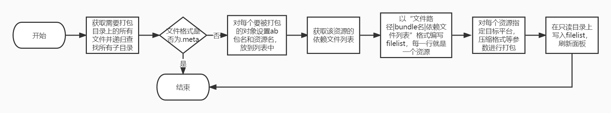
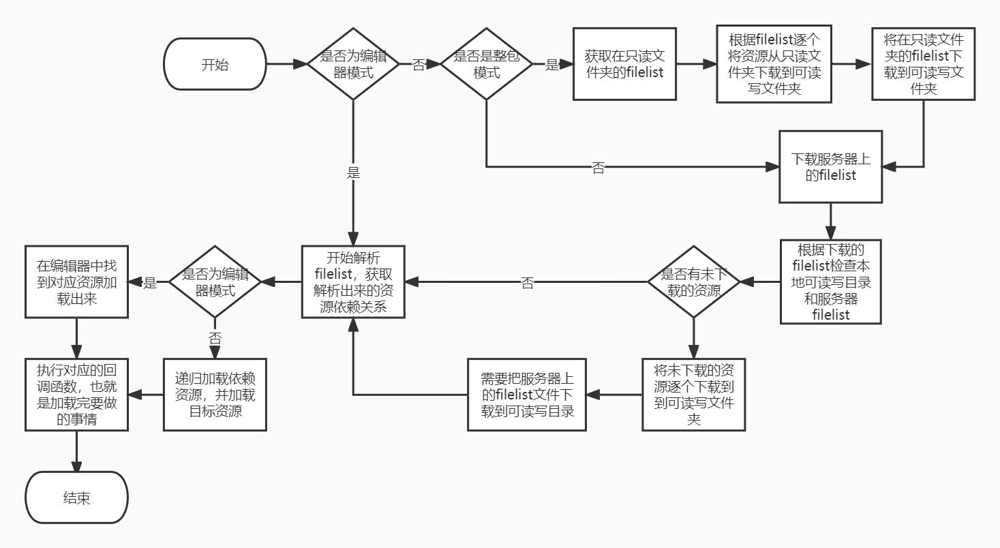
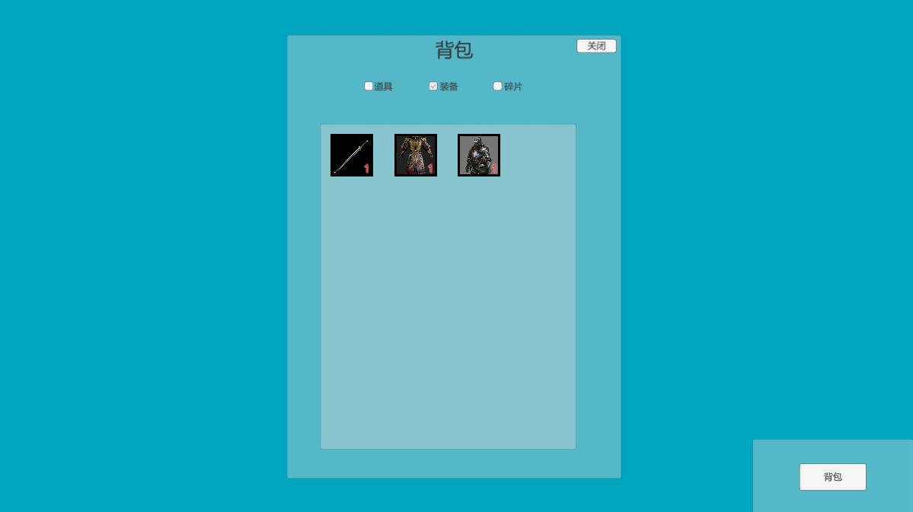
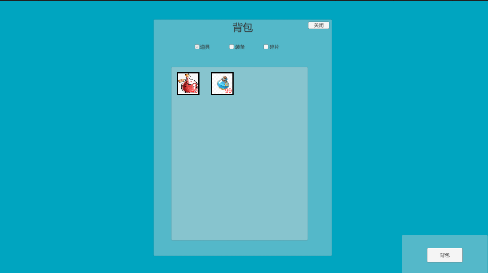

# XLua背包热更新Demo

## 项目打包流程（BuildTools）

## 项目热更新流程

支持三种模式：（在GameStart标签内更改）

1. 编辑器模式：不加载AB包，直接加载项目中的Prefab，不需要频繁打ab包，便于开发
2. 整包模式：加载AB包，从只读文件夹加载资源，对比服务器上有无需要更新的资源，有则更新，无则开始游戏，首次更新较快但是包体较大
3. 分包模式：加载AB包，不依赖只读文件夹，从服务器中加载资源到可读写文件夹，因为资源在服务器上所以首次更新缴满，但是包体较小

## 项目图片

 

 
